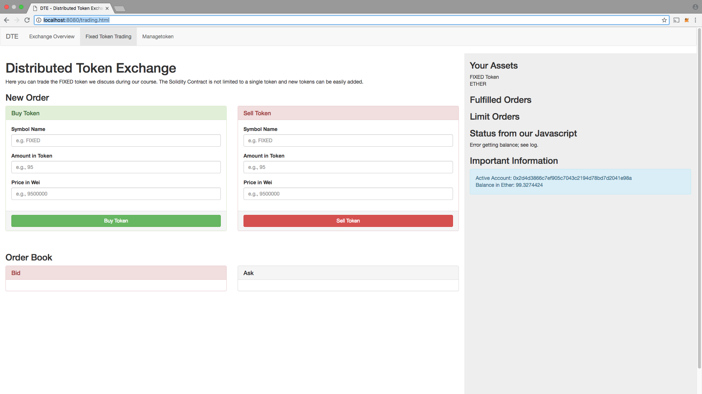

# Ethereum Exchange
> An Ethereum Distributed Token Exchange

This is a small token exchange in which you can test with Truffle and MetaMask. This exchange has the ability to add your own test ERC20 token to an exchange and send to different test addresses. There are also features such as Limit and Market orders.



## Installation 

In the Project's root directory:
```sh
npm install -g ethereumjs-testrpc
```

Then run the following to install required packages:
```sh
npm install
```

## Usage
```sh
npm run dev
```
Then open `http://localhost:8080/` in your Chrome browser

